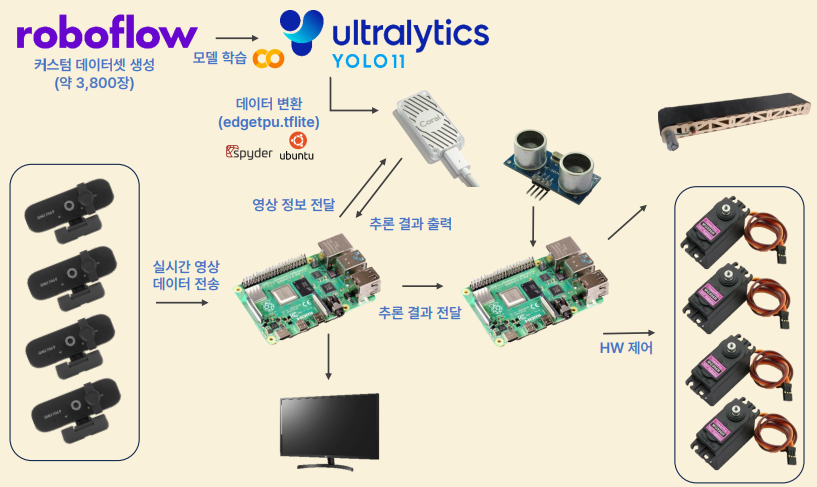
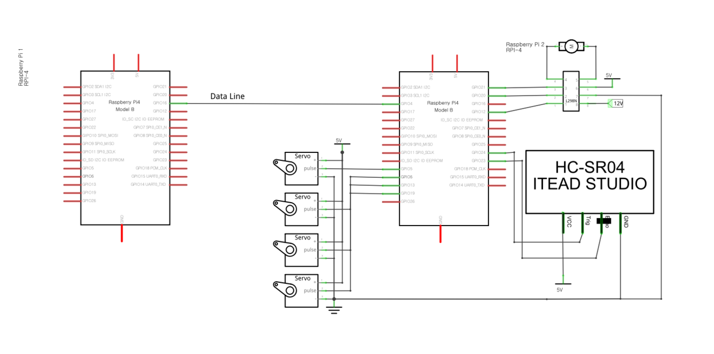
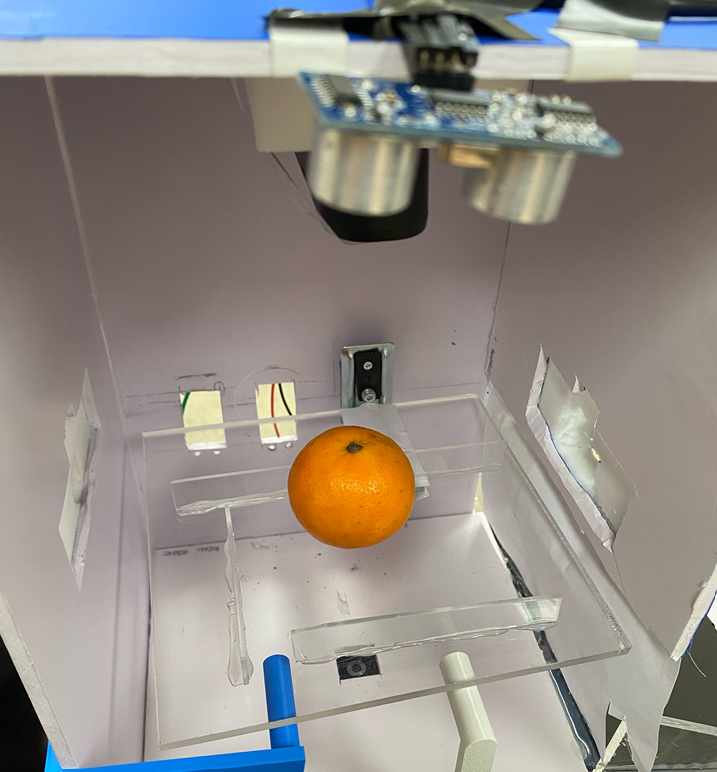
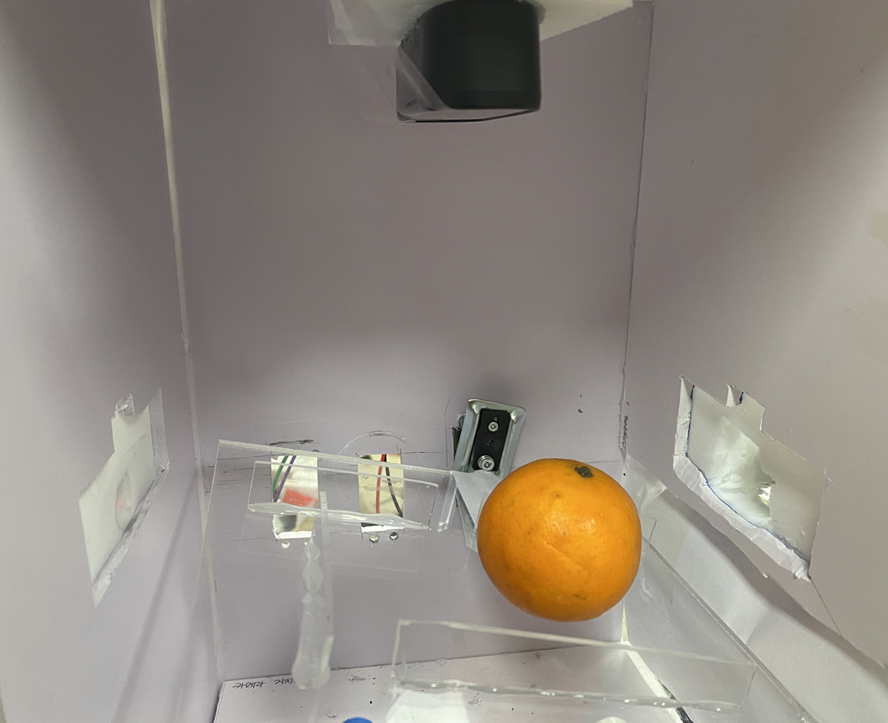
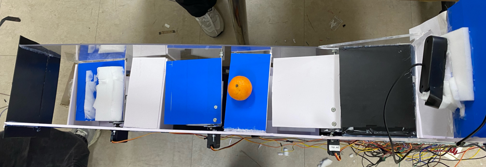
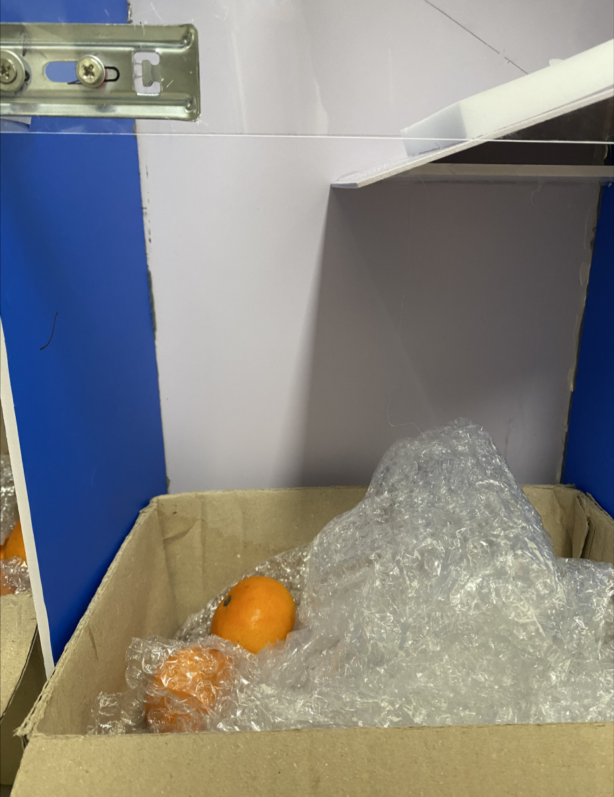
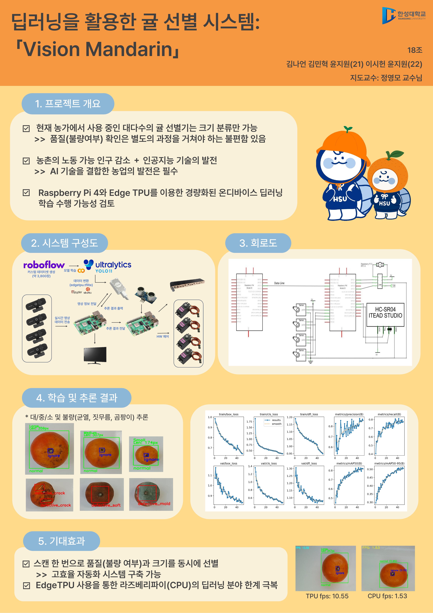

# 🍊 Vision Mandarin — 딥러닝을 활용한 귤 선별 시스템

> 컨베이어로 이송된 귤을 4대의 카메라로 스캔하고, Edge TPU 추론 결과에 따라 크기·불량을 실시간 자동 분류하는 시스템

🏆 **한성대학교 종합설계 프로젝트 은상 수상**

---

## 📖 Overview

| 항목 | 내용 |
|---|---|
| 구분 | 졸업작품 · 팀 프로젝트 (5인 — HW 2명 / SW 3명) |
| **담당** | **HW 파트 — 컨베이어·분류기 기구 설계, 센서/모터 제어 회로 구현** |
| 목표 | 이미지 처리와 딥러닝을 활용한 귤의 크기·불량 자동 분류 |
| 분류 클래스 | 대 / 중 / 소 / 불량 (균열 · 짓무름 · 곰팡이) |
| 지도교수 | 정영모 교수님 |

기존 농가의 선별기는 크기 분류만 가능해 품질(불량 여부) 확인은 별도 과정을 거쳐야 합니다.
Vision Mandarin은 **스캔 한 번으로 크기와 품질을 동시에 판정**해 이 과정을 하나로 합쳤습니다.

<p align="center">
  <br>
  <em>전체 시스템 구성도</em>
</p>

---

## 🏗 시스템 구조

라즈베리파이 2대를 **TCP/IP로 연동**해 추론부와 제어부를 분리했습니다.
추론과 모터 제어를 한 보드에서 처리하면 서로 지연을 유발하기 때문에,
역할을 나눠 각자 독립적으로 동작하도록 구성했습니다.

| 보드 | 역할 |
|---|---|
| **RPi #1 (추론)** | 웹캠 4대 영상 수신 → Edge TPU 추론 → 결과를 TCP로 송신 |
| **RPi #2 (제어)** | 초음파 센서 감지, 컨베이어·서보모터 제어, 추론 결과 수신 후 분류 |

### 하드웨어 모듈

| 부품 | 역할 |
|---|---|
| Raspberry Pi 4 × 2 | 추론 / 제어 분리 운용 |
| Google Coral Edge TPU | 추론 가속 — 미사용 시 CPU만으로는 실시간 처리 불가 |
| USB 웹캠 × 4 | 스캔 구역 상·하·좌·우에서 동시 촬영 |
| 기어드 모터 + 모터 드라이버 | 컨베이어 벨트 구동, PWM 속도 제어 |
| 서보모터 × 4 | 스캔 구역 바닥면 1개 + 분류 구역 차단막 3개 |
| 초음파 센서 (HC-SR04) | 귤 도달 감지 트리거 |

<p align="center">
  <br>
  <em>회로도 — 라즈베리파이 2대, 서보모터 4개, 모터 드라이버, 초음파 센서 결선</em>
</p>

---

## 🚀 동작 프로세스

```
① 컨베이어 이송  →  ② 초음파 센서 감지 → 벨트 정지
                          ↓
③ 스캔 구역 진입  →  ④ 웹캠 4대 촬영 → Edge TPU 추론 (3초)
                          ↓
⑤ 최빈값 결과 선정 → TCP 송신  →  ⑥ 서보모터로 차단막 개방
                          ↓
⑦ 스캔 구역 바닥면 회전 → 귤 배출  →  ⑧ 벨트 재작동
```

<p align="center">
  
  <br>
  <em>컨베이어 이송 및 스캔 구역 동작</em>
</p>

**오탐 방지 설계**
3초 동안 연속 추론한 결과 중 **가장 많이 카운트된 값(최빈값)** 을 최종 판정으로 사용했습니다.
단발 추론은 조명이나 귤의 각도에 따라 결과가 흔들리기 때문입니다.
3초 내에 탐지하지 못하면 재추론에 들어가 전체 시스템이 멈추지 않도록 했습니다.

---

## 🤖 AI 파이프라인

| 단계 | 내용 |
|---|---|
| 데이터셋 | 직접 촬영 + Roboflow 증강, 약 **3,800장** 커스텀 데이터셋 |
| 학습 | YOLO11, Google Colab GPU |
| 변환 | `.pt` → `float32.tflite` → 양자화 `int8.tflite` → `edgetpu.tflite` |
| 추론 | Raspberry Pi 4 + Coral Edge TPU |

### 성능

| | 추론 속도 |
|---|---|
| CPU 단독 | 1.53 fps |
| **Edge TPU 적용** | **10.55 fps** |

**약 6.9배 향상**되어 실시간 선별이 가능한 수준에 도달했습니다.

---

## 🔍 Troubleshooting

담당한 HW 파트에서 겪은 문제들입니다.

### 1. 컨베이어 구동 모터 교체와 축 결합

기본 제공된 DC 모터는 회전 속도가 너무 느려 귤 이송에 쓸 수 없었습니다.
기어드 모터로 교체했지만 **축의 위치와 형태가 달라 기존 구조물에 결합되지 않았습니다.**

축 높이와 간격을 다시 잡고 그에 맞는 고정 구조를 별도로 설계했습니다.
이송 중 귤이 밀리는 문제는 PWM으로 속도를 안정화하고,
초음파 센서 감지 시점에 맞춰 모터를 정지시키는 제어 흐름을 붙여 해결했습니다.

### 2. 분류기 축 고정 불안정

포맥스·아크릴 재질을 모터 축에 직접 연결하니 **회전축 정렬과 무게 중심을 맞추기 어려워**
분류기가 흔들리거나 기구물이 이탈했습니다.

여러 방식을 시도한 끝에 **브라켓을 이용한 고정 구조**로 바꿨습니다.
모터 축과 구조물이 정밀하게 결합되면서 회전 시 진동과 오차가 크게 줄었습니다.

### 3. 분류기 경사각 재설계 ⭐

초기에는 귤이 굴러 내려가는 경사각을 **60도**로 설계했습니다.
계산상으로는 충분한 낙하 각도였지만, 실제로는 **가속도가 과하게 붙어
분류 구멍을 통과하지 못하고 튕겨 나갔습니다.**

원인은 귤의 무게와 표면 재질, 경사면 마찰력을 계산에 넣지 않았다는 점이었습니다.
분류기 구조를 전면 해체하고 경사각을 완만하게 줄여 재설계한 뒤,
귤이 목표 구멍으로 안정적으로 진입하는 것을 확인했습니다.

> **배운 점** — 이론값이 맞아도 실물의 물성을 고려하지 않으면 동작하지 않는다는 것을
> 구조물을 두 번 만들면서 체감했습니다. 이후로는 설계 단계에서 반드시 시제품으로
> 먼저 확인하고 본 제작에 들어갔습니다.

### 4. Edge TPU 모델 변환 (SW 팀 협업)

일반 `.tflite`가 아닌 Edge TPU 전용 형식으로 변환해야 했는데,
패키지 버전이 조금만 어긋나도 변환이 실패했습니다.
가상환경을 따로 구성해 라이브러리 버전을 개별 지정한 끝에 변환에 성공했습니다.

---

## 📊 결과물

<p align="center">
  
  <br>
  <em>추론 결과에 따른 분류 구역 배출</em>
</p>

<p align="center">
  <br>
  <em>최종 발표 판넬</em>
</p>

---

## 🛠 Tech Stack

`Python` `OpenCV` `TensorFlow Lite` `YOLO11` `Raspberry Pi 4` `Google Coral Edge TPU` `RPi.GPIO` `Roboflow`

---

## 👥 팀 정보

- **소속**: 한성대학교 전자/시스템반도체 트랙
- **지도교수**: 정영모 교수님
- **구성**: HW 2명 / SW 3명

---

## 🔗 Related

- [전체 포트폴리오](https://github.com/Yoonjiwon-0305)
